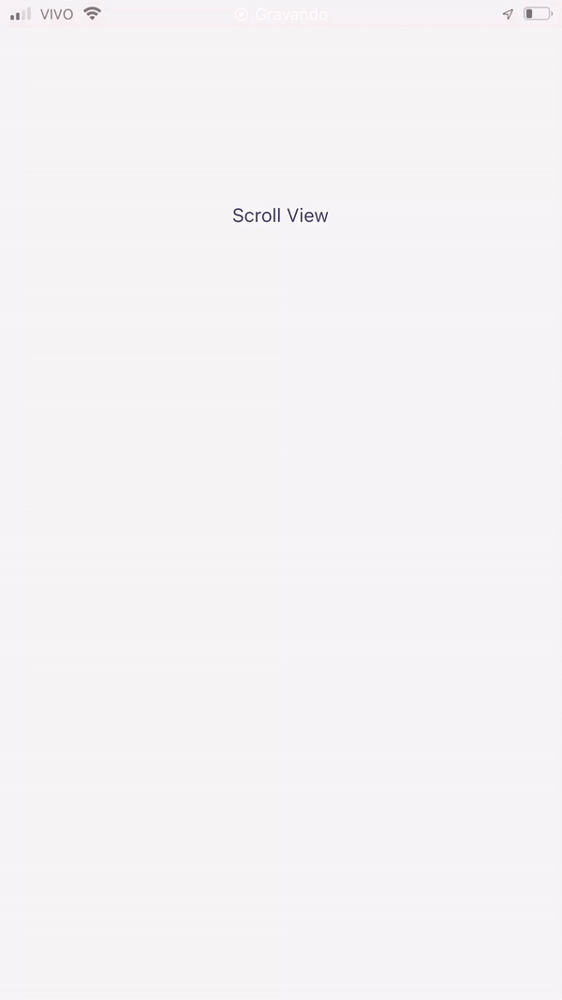

# Animation header
<br>
<br>

 
 ```
   yarn add react-native-animation-header 
 ```



<br>


## Example

```typescript 

import RNAnimationHeader ,{ AnimationHeaderRef } from "react-native-animation-header"
import Text from "react-native"

export function App() {

    const animationHeaderRef = useRef<AnimationHeaderRef>(null)

    return (
        <>
         <RNAnimationHeader
            title="Hello World"
            ref={animationHeaderRef} 
            limit={60} // limit to toggle default 250
            changeStatusBarColor={false} // change statusBar color toggle set true if change default 55
             
            //   leftElement={ // left element
            //      <MaterialIcons name="keyboard-arrow-left" size={24} color="black" />
            //   }
            //   rightElement={ // right element
            //     <View/>
            //   }
            //    directions={{ 
            //     from:'light-content',// hide header statusBar color default dark-content
            //     to:'dark-content' // show header statusBar color default light-content
            //    }}
            //    customStyleContainer={{ // container style
            //        backgroundColor:'red'
            //    }}
            //    customStyleText={{ // text center style
            //        fontSize:20
            //    }}
            //    animationDuration={200} // 200ms
         />
         <ScrollView
            showsVerticalScrollIndicator={false}
            scrollEventThrottle={16}
            onScroll={(event) =>  {               
                if(animationHeaderRef.current) {
                    animationHeaderRef.current.getScrollPosition(event)
                }
            }}
            contentContainerStyle={{ height: 1500 , alignItems:'center' , paddingTop:100 }}
         >
             <Text>Scroll View</Text>
         </ScrollView>
        </>
    )
}

```

